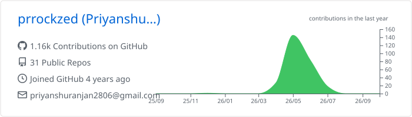
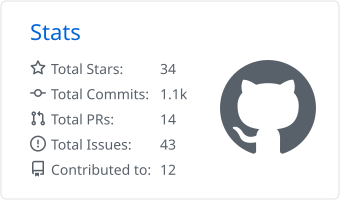
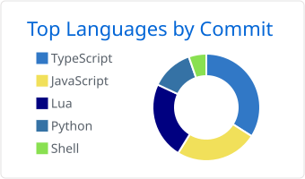

<h1 align="center">Hi 👋, I'm Priyanshu Ranjan</h1>

  Developer from Kolkata, currently building <b>AgentKavach</b>. 
  I like AI agents, developer tooling, and anything that lives in a terminal.

  
  
  

---

### 🛠️ Tech

  
  
  
  
  
  
  
  
  
  

### 📌 Selected work

| Project | What it is |
| --- | --- |
| [**chessed**](https://github.com/prrockzed/chessed) | A playable chess variant built with React |
| [**nvimDev**](https://github.com/prrockzed/nvimDev) | A fast, keyboard-first Neovim distro |
| [**AgentScope**](https://github.com/prrockzed/AgentScope) | Observe, debug, and evaluate AI agents in real time |
| [**Priya**](https://github.com/prrockzed/priya) | A local, LLM-agnostic agentic operating system |
| [**sportscli**](https://github.com/prrockzed/sportscli) | Live chess, cricket, and football scores in your terminal |

### 📊 Stats

<!-- Generated daily by .github/workflows/profile-stats.yml -->

  <picture>
    <source media="(prefers-color-scheme: dark)" srcset="./profile-summary-card-output/github_dark/0-profile-details.svg"/>
    
  </picture>

  <picture>
    <source media="(prefers-color-scheme: dark)" srcset="./profile-summary-card-output/github_dark/3-stats.svg"/>
    
  </picture>
  <picture>
    <source media="(prefers-color-scheme: dark)" srcset="./profile-summary-card-output/github_dark/2-most-commit-language.svg"/>
    
  </picture>

  <picture>
    <source media="(prefers-color-scheme: dark)" srcset="https://raw.githubusercontent.com/prrockzed/prrockzed/output/snake-dark.svg"/>
    
  </picture>

